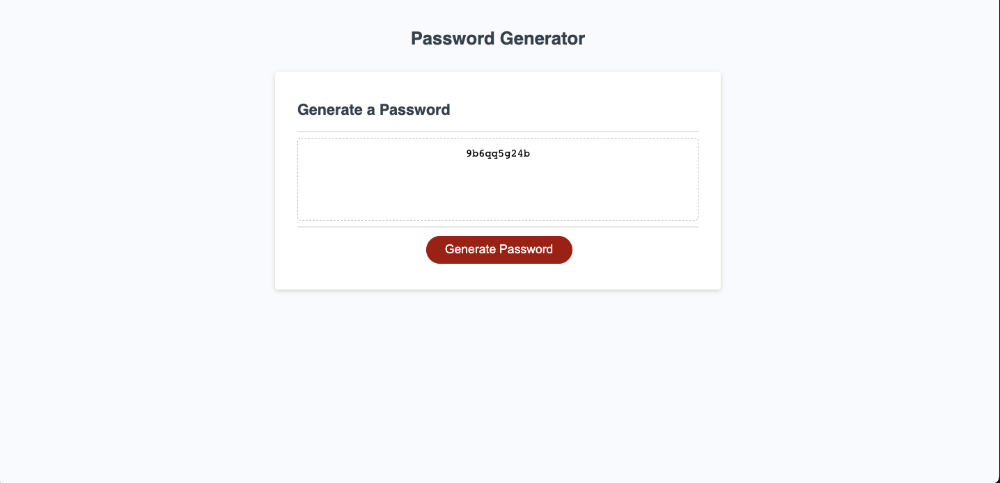

# Password Generator

This application is used to create a randomly generated password for the user. The user determines which paramaters he/she would like to include and the password is then generated.

## Demo

https://wtguenthner.github.io/PasswordGenerator/

## Screenshots

## Lessons Learned

In this project I learned how to define arrays and combine them based on command prompts. I also learned the importance of if/then statements and loops to take a users input, examine it, and display messages based on the values submitted.

